# IPConfigure Java Programming Evaluation

### Access Instructions

In order to access the java files I have created, it is **highly** recommended that you use an Eclipse IDE.\
The files in this project were created using Eclipse. Eclipse auto-builds files and projects, meaning build scripts aren't necessary
for compilation and creation in Eclipse.\
\
This README file will explain how to run each of the specific projects and will give any additional info regarding them.
I will also include a developer diary of sorts at the end, so feel free to view that if you wish.\
\
It is assumed from this point forward that Eclipse is being used to run these programs, 
therefore instructions will be directed to work in Eclipse.
## Download instructions
To download these files, click clone or download on the main page of the repository https://github.com/dhanb001/Ipconfig

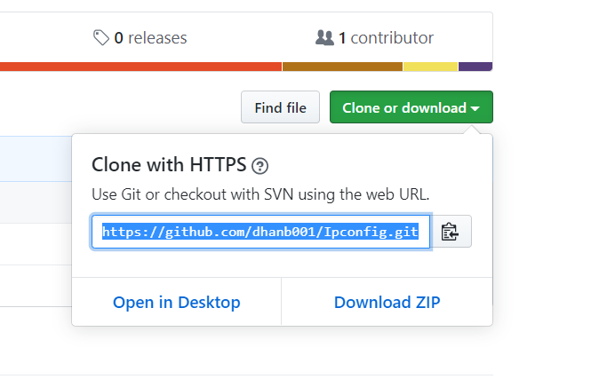

The clone URL is: https://github.com/dhanb001/Ipconfig.git

Once you have the clone URL. Open your Eclipse IDE

### Cloning the repository in Eclipse

1. Go to your workbench in Eclipse.
2. Click the Quick Access box in the upper right corner and type in *"Clone a github repository"*
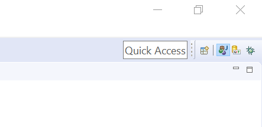
3. Select Clone a github repository.
4. Once selected, this should appear:
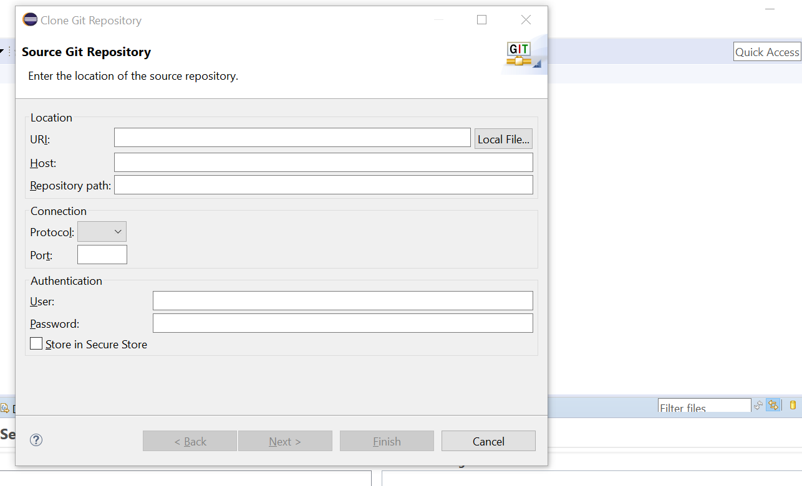
5. Now, place the clone URL from github into the top box titled URI.
6. Once you have entered the URL, enter your Github User and Password below.
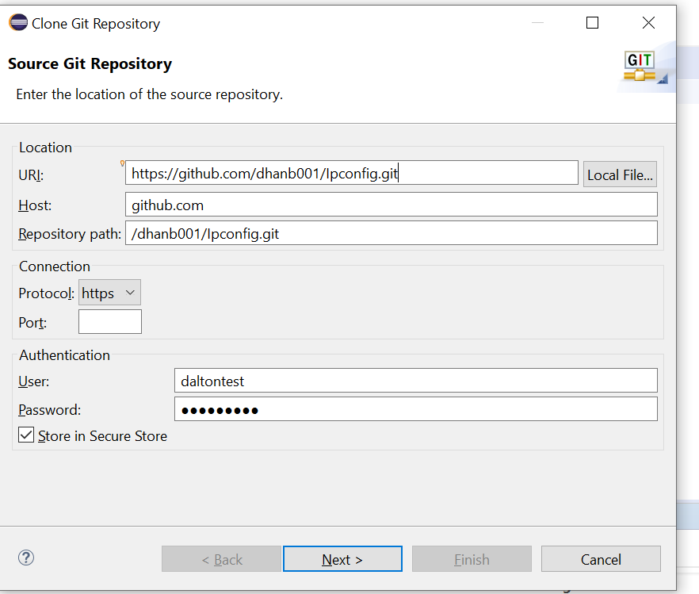
Once your screen looks similar to this, press **next.**
7. Now select a local directory to store the cloned project. **Be sure to remember the location you stored it.**
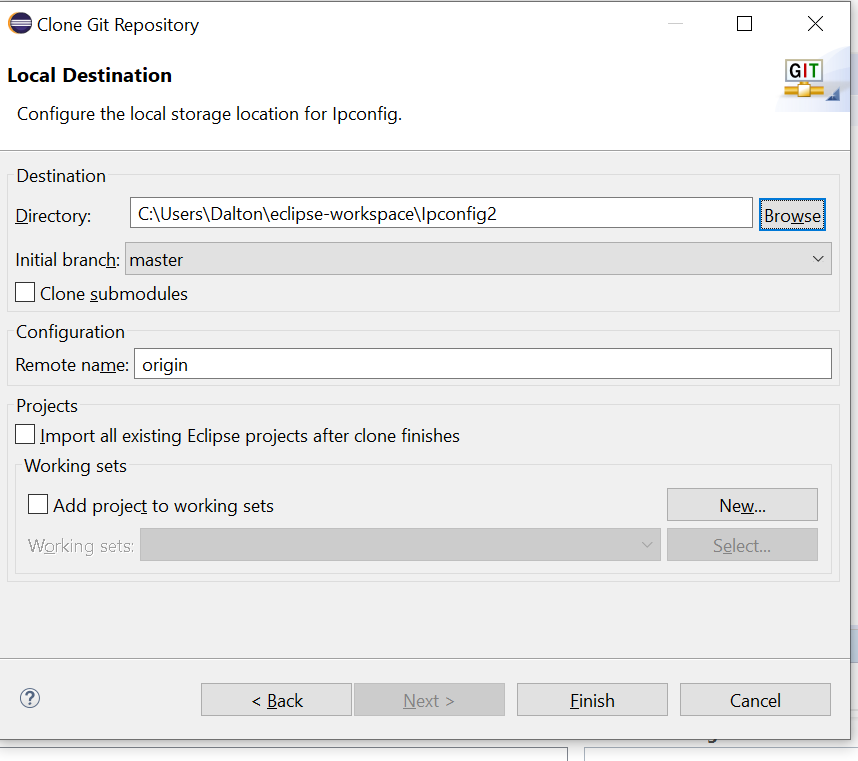
8. Now press **Finish.**

### Accessing the Repository

You've successfully cloned the repository, but you still need to access it in your workspace.
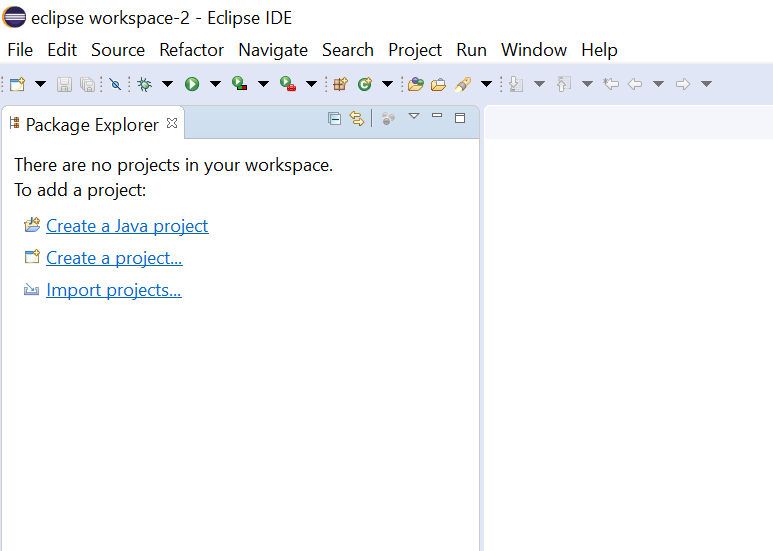\
There's a few steps we need to take to accomplish that.

1. Go to the quick access box in the corner, and type in *"Open Projects from File System"

2. Once you've opened the quick access tab, you should see this.
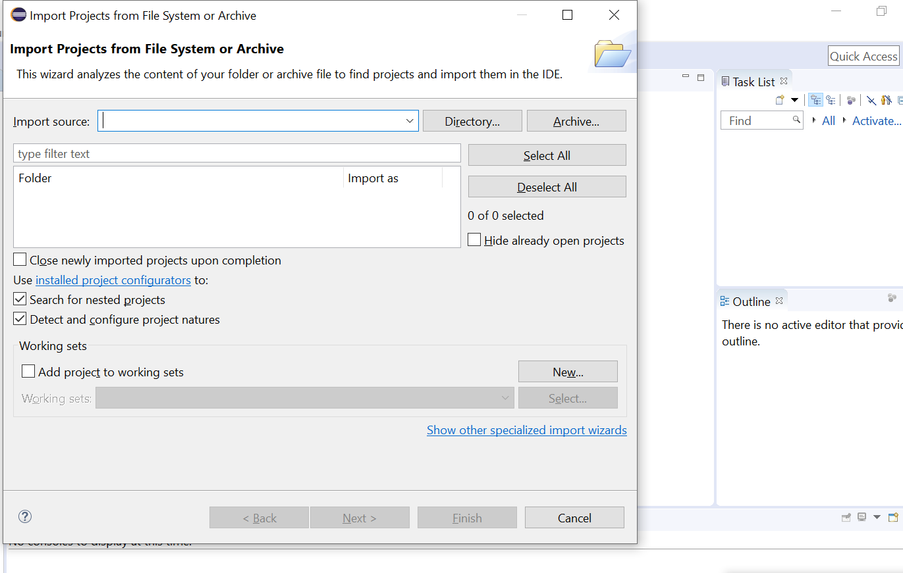

3. Now, navigate to the directory where you stored the repository.
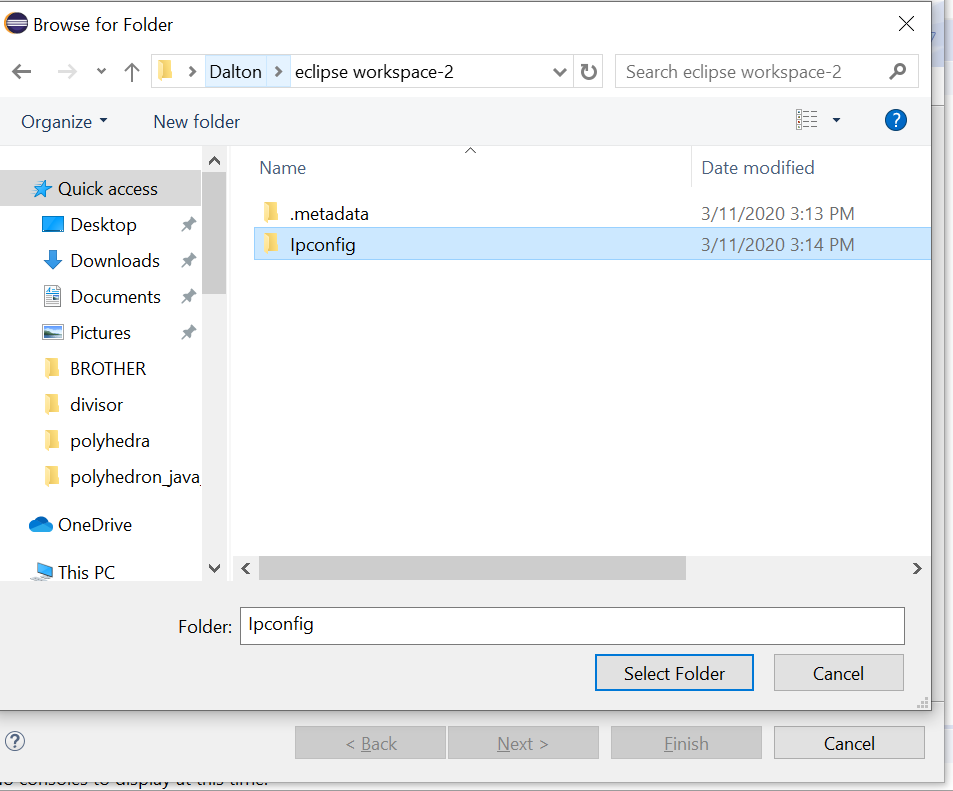
And select the folder named IPConfig.

4. Now just press **finish.**
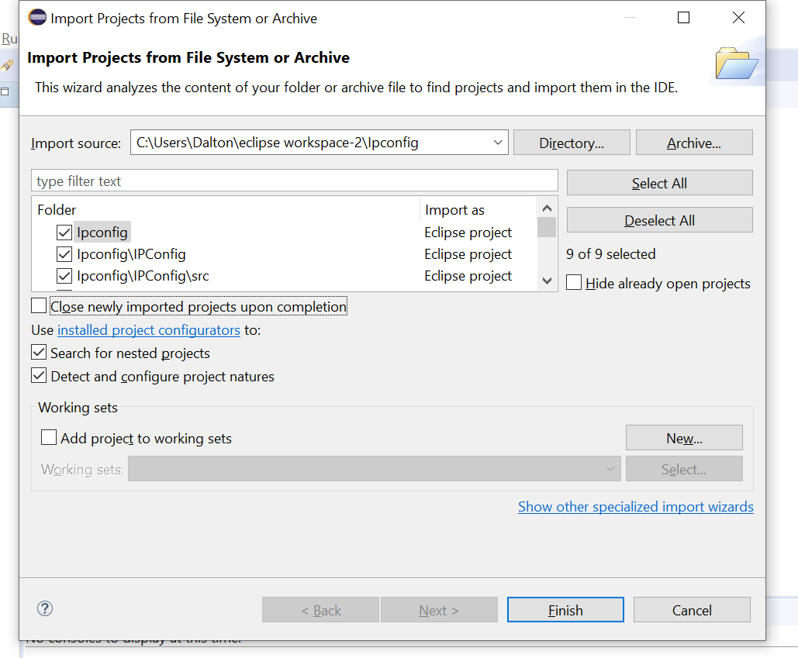

You're done!

Now your screen should look like this:\

And if you open the folders, they should look like:
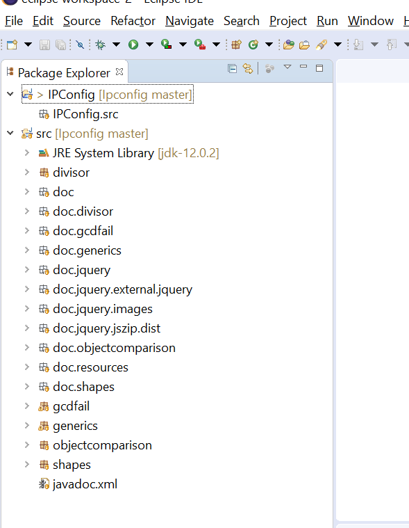

Now we just need to run the projects.

But first, we'll go over how to access the JavaDocs for these projects.

## JavaDoc Access

Accessing the JavaDocs in Eclipse is fairly simple and only takes a few steps.

1. Open the *doc* package under the src folder.
2. Select *allclasses-index.html* and open it.\
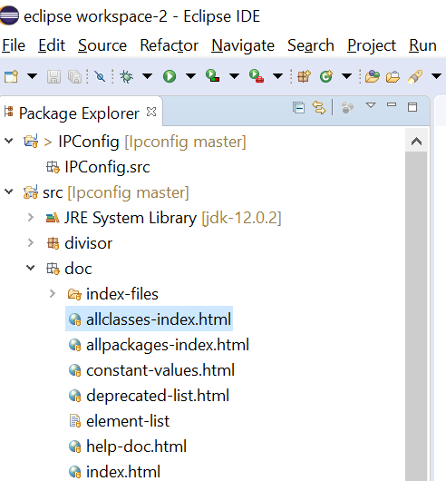

3. Once you have opened allclasses, your screen should look like this:\
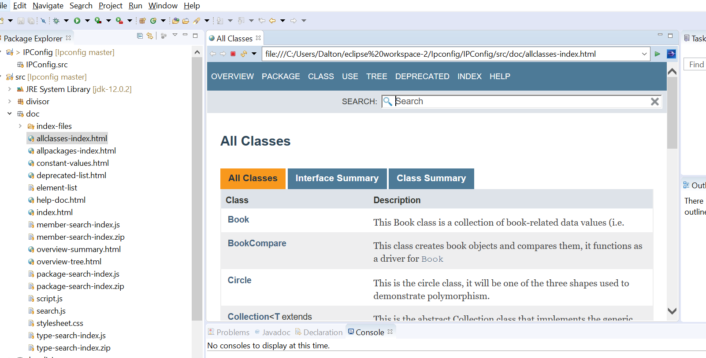

4. The JavaDoc is now open, and you can browse freely throughout the documentation. If you'd like to see an overview, 
select overview from the upper bar.\
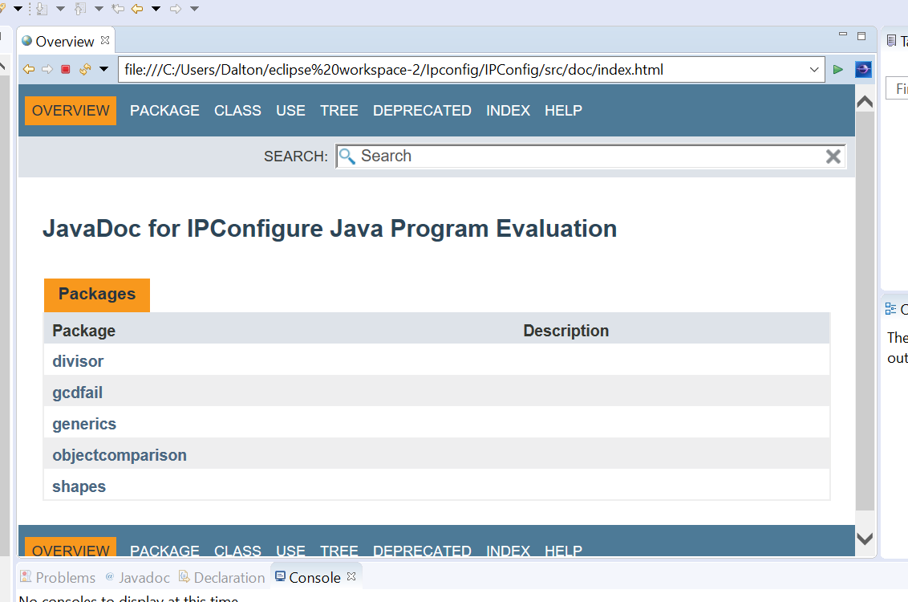

Now you have access to the JavaDoc files, feel free to navigate around as much as you like and examine the documentation.

## Programming Questions

The 4 programming questions were answered in individual packages for easy separation.

1. Inheritance- **shapes** package.

2. Generics- **generics** package.

3. Object Comparison- **objectcomparison** package.

4. Greatest Common Divisor- **divisor** package.\
NOTE: The gcdfail package was my first (failed) attempt to solve question 4, use it to see my thought process.

### Inheritance
For this question, navigate to the shapes package and open *Shapetester.java*\
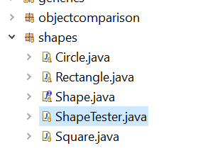

To run this program, right click on *ShapeTester.java* and select **run as.** Then select *Java Application.*

This program's console output runs through a thorough demonstration of the question.
If you would like to view it, start from the beginning of the console output and read until the end.

All other classes for this question can be found in the shapes package.

### Generics
For this question, navigate to the generics package and open *CollectionTester.java*\
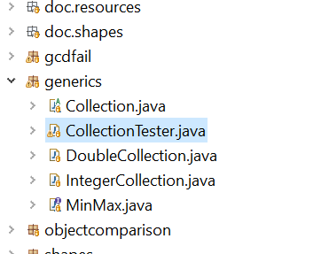

To run this program, right click on *CollectionTester.java* and select **run as.** Then select *Java Application.*

This program's console output runs through a thorough demonstration of the question.
If you would like to view it, start from the beginning of the console output and read until the end.

All other classes for this question can be found in the generics package.

### Object Comparison
For this question, navigate to the objectcomparison package and open *BookCompare.java*\
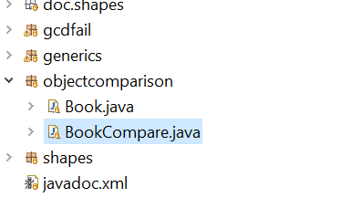

To run this program, right click on *BookCompare.java* and select **run as.** Then select *Java Application.*

This program's console output runs through a thorough demonstration of the question.
If you would like to view it, start from the beginning of the console output and read until the end.

The other classes for this question can be found in the objectcomparison package.

### Greatest Common Divisor
For this question, navigate to the divisor package and open *GreatestDivisor.java*\
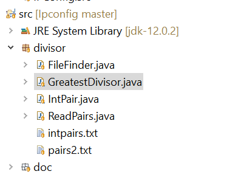

To run this program, right click on *GreatestDivisor.java* and select **run as.** Then select *Java Application.*

This program's console output **does not run through a thorough demonstration of the question.**\
Careful examination of the code in all .java files in this package is required for this question. However, comments are frequent and the code is fairly easy to follow.

The other classes for this question, and the text file used for input can be found in the divisor package.

## Developer Diary

  First, I would like to say that these questions have been extremely helpful in my learning of Java. I thought I knew a fairly large amount, but these questions forced me to teach myself much more than I thought necessary. However, I used my copy of Oracle's *Java The Complete Reference Ninth Edition* to teach myself the necessary concepts and strategies in order to complete these questions. I have learned more from these assignments than I have learned in a single semester in the classroom.
