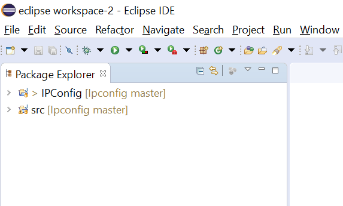

# IPConfigure Java Programming Evaluation

### Access Instructions

In order to access the java files I have created, it is **highly** recommended that you use an Eclipse IDE.\
The files in this project were created using Eclipse. Eclipse auto-builds files and projects, meaning build scripts aren't necessary
for compilation and creation in Eclipse.\
\
This README file will explain how to run each of the specific projects and will give any additional info regarding them.
I will also include a developer diary of sorts at the end, so feel free to view that if you wish.\
\
It is assumed from this point forward that Eclipse is being used to run these programs, 
therefore instructions will be directed to work in Eclipse.
## Download instructions
To download these files, click clone or download on the main page of the repository https://github.com/dhanb001/Ipconfig

The clone URL is: https://github.com/dhanb001/Ipconfig.git

Once you have the clone URL. Open your Eclipse IDE

### Cloning the repository in Eclipse

1. Go to your workbench in Eclipse.
2. Click the Quick Access box in the upper right corner and type in *"Clone a github repository"*

3. Select Clone a github repository.
4. Once selected, this should appear:

5. Now, place the clone URL from github into the top box titled URI.
6. Once you have entered the URL, enter your Github User and Password below.

Once your screen looks similar to this, press **next.**
7. Now select a local directory to store the cloned project. **Be sure to remember the location you stored it.**

8. Now press **Finish.**

### Accessing the Repository

You've successfully cloned the repository, but you still need to access it in your workspace.
\
There's a few steps we need to take to accomplish that.

1. Go to the quick access box in the corner, and type in *"Open Projects from File System"

2. Once you've opened the quick access tab, you should see this.

3. Now, navigate to the directory where you stored the repository.

And select the folder named IPConfig.

4. Now just press **finish.**

You're done!

Now your screen should look like this:\

And if you open the folders, they should look like:

Now we just need to run the projects.
